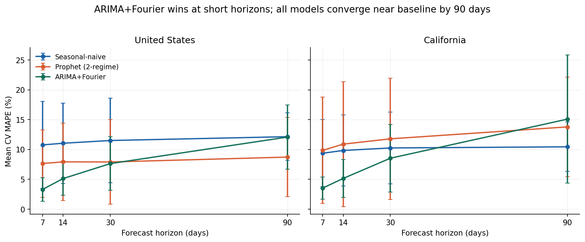
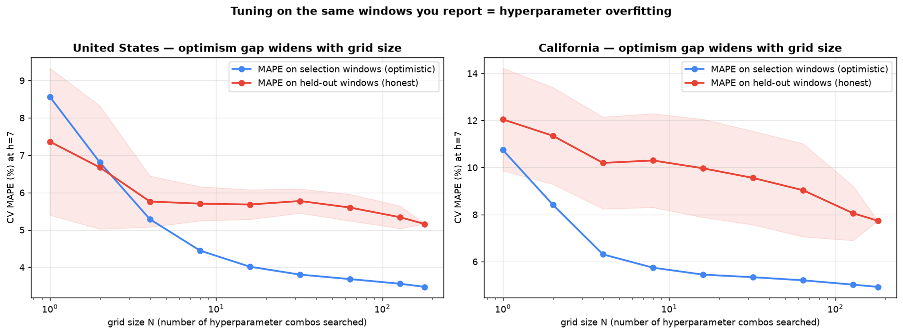

# ARICast: forecasting acute respiratory illness (ARI) ED visit load

Forecasting the daily share of U.S. emergency-department (ED) visits attributable to
**acute respiratory illness (ARI)**, using open CDC NSSP data for the nation and for
California — and comparing five forecasting approaches across four horizons.

> **Headline finding:** *the right model depends on the forecast horizon.* ARIMA+Fourier
> cuts short-horizon error to ~3–5% MAPE (less than half the seasonal-naive baseline);
> by 90 days every complex model degrades to or below a simple baseline. A "do-nothing"
> persistence forecast turns out to be the second-best model at the 7-day operational horizon.

---

## Why this project

Respiratory ED load is strongly seasonal, but the timing and height of each season vary year
to year, and staffing for surges is often planned reactively. A short-horizon forecast turns
that planning proactive the operational question is *"what will next week look like?"*, which
is exactly the horizon where the modeling here is strongest. 
## Data

- **Source:** CDC NSSP *Emergency Department Respiratory Daily* (dataset `vjzj-u7u8`,
  data.cdc.gov, public domain).
- **Target (`y`):** `percent_visits` — the **share** of ED visits attributed to ARI. A
  **proportion, not an absolute count**; used as a load proxy, and that limitation is stated
  rather than hidden.
- **Geographies:** United States (national) and California, modeled separately.
- **Coverage:** 1,351 consecutive daily observations per series, 2022-09-25 → 2026-06-06,
  zero missing dates, zero duplicates (verified in Phase 0).

## Approaches compared

| Approach | Description |
|---|---|
| **Persistence** | `ŷ = last observed value`. Pure inertia; strong at short horizons. |
| **Seasonal-naive** | `ŷ_t = y_{t−365}`. Pure seasonality; horizon-robust, wins at 90 days. |
| **Prophet (two-regime)** | Additive Prophet; trend flexibility by regime flexible (`cps=0.5`) short, stiff (`cps≈0.001–0.01`) long. |
| **ARIMA + Fourier** | `auto_arima` (order per window) + Fourier yearly/weekly terms. Wins at short horizons. |

All scored on **identical rolling cross-validation windows** (`initial=900, step=30`).

## Results

Mean CV MAPE (%), canonical run:

| Horizon | Series | Persistence | Seasonal-naive | Prophet | ARIMA+Fourier |
|---:|---|---:|---:|---:|---:|
| 7  | US | 5.03 | 10.76 | 4.53 | **3.29** |
| 7  | CA | 4.64 | 9.36 | 9.12 | **3.51** |
| 14 | US | 6.95 | 11.04 | 5.60 | **5.12** |
| 14 | CA | 5.70 | 9.83 | 11.04 | **5.14** |
| 30 | US | 10.76 | 11.50 | 8.20 | **7.63** |
| 30 | CA | 9.58 | 10.25 | 11.77 | **8.53** |
| 90 | US | 21.83 | 12.14 | **8.82** | 12.07 |
| 90 | CA | 18.87 | **10.44** | 13.70 | 15.08 |

**Operational rule that falls out:** use **ARIMA+Fourier for 0–14 day** planning; fall back to
**seasonal-naive (or stiff Prophet on US) at 90 days**. Anything fancier than the right baseline
at long horizons is wasted complexity.



## The methodology spine (the part worth reading)

This project earned its numbers by repeatedly catching itself being fooled — a progression from
naive validation to genuine rigor:

1. **Single-split traps (×3).** Single train/test splits gave Prophet-CA 6.8% (CV: 11.0%),
   ARIMA-US-90d 4.77% (CV: 18.7%), Prophet-US 9.3% (built-in CV) vs 16.9% (manual rolling CV).
   *Fix:* every model on identical rolling windows, mean ± std.
2. **Horizon/window mismatch.** An early table compared naive on a 365-day holdout against
   Prophet on a 90-day CV. *Fix:* identical windows **and** horizon for all models.
3. **Hyperparameter overfitting (the optimism gap).** Tuning Prophet's `changepoint_prior_scale`
   on the same windows used to report inflates the score by up to ~4.5 points. Measured directly
   by splitting windows into selection/holdout sets and tracing the gap as the grid grows.
   *Fix:* a tiny, theory-motivated **two-regime** trend rule (flexible short, stiff long), not a
   per-window-tuned optimum.



## Notebooks

- `00_data_acquisition.ipynb` — load, integrity-check, reshape to `(ds, y)`.
- `01_eda_baseline.ipynb` — decomposition, weekly pattern, the two baselines.
- `02_prophet_modeling.ipynb` — Prophet pipeline, grid-search shape, two-regime rule, 90-day forecast.
- `02b_arima_comparison.ipynb` — the five-model comparison across horizons (headline result).
- `02c_optimism_gap.ipynb` — hyperparameter-overfitting experiment.
- `03_diagnostics.ipynb` — residual analysis, Ljung-Box, prediction-interval coverage.

## Repository structure

```
aricast/  (repo-slug: ed-respiratory-forecast)
├── data/
│   ├── raw/        NSSP_Emergency_Department_Respiratory_Daily.csv  (download from CDC; not committed)
│   └── processed/  ari_*.csv, full_cv_results_parallel.csv, master_comparison.csv, ...
├── notebooks/      00_, 01_, 02_, 02b_, 02c_, 03_ .ipynb
├── src/
│   ├── prepare_data.py                   Phase 0
│   ├── full_cv_experiment_parallel.py    rolling-window CV, all models (joblib)
│   ├── prophet_gridsearch.py             Prophet grid search (canonical geometry)
│   ├── prophet_flexibility_diagnostic.py persistence / plateau / trend checks
│   ├── optimism_gap_experiment.py        the optimism-gap measurement
│   ├── phase3_diagnostics.py             residuals, Ljung-Box, interval coverage
│   ├── make_fig_02b.py                   rebuild the MAPE-vs-horizon figure
│   └── build_02c.py                      assemble the 02c notebook
└── reports/figures/ *.png
```

## Reproducing

```bash
# Python 3.11 / 3.12 (Prophet + pmdarima wheels). Windows: .venv\Scripts\activate
python -m venv .venv && source .venv/bin/activate
pip install pandas numpy matplotlib joblib prophet pmdarima statsmodels

# download the CDC CSV into data/raw/, then:
python src/prepare_data.py                 # -> data/processed/ari_*.csv
python src/full_cv_experiment_parallel.py  # -> full_cv_results_parallel.csv
# (optional deeper experiments)
python src/prophet_gridsearch.py
python src/optimism_gap_experiment.py
# rebuild notebooks:
jupyter nbconvert --to notebook --execute --inplace notebooks/*.ipynb
```

The CV experiments fan independent windows across CPU cores with `joblib`. GPU gives nothing
here: the workload is *many small independent fits*, not one heavy matrix op (ARIMA's likelihood
optimization is sequential; Prophet's Stan backend gains nothing on a 1,351-point series).

## Limitations

- Target is a **proportion of ED visits**, not an absolute patient count — a load proxy.
- US federal holidays were tested and barely move the proportion (US −0.47 pp, CA +0.12 pp).
- National and California modeled separately (different seasonal amplitudes); a hierarchical
  multi-region model is future work.

  ---

*Data: CDC NSSP, public domain.*
